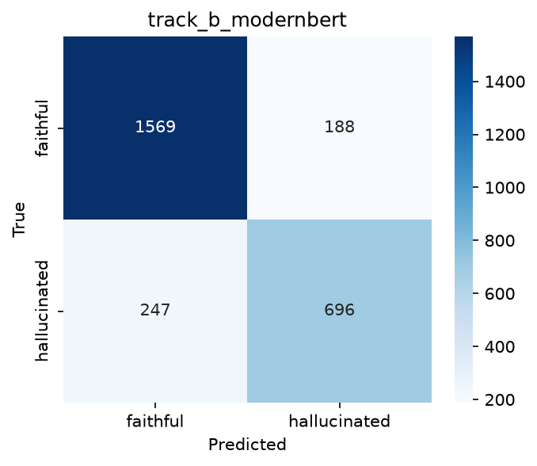
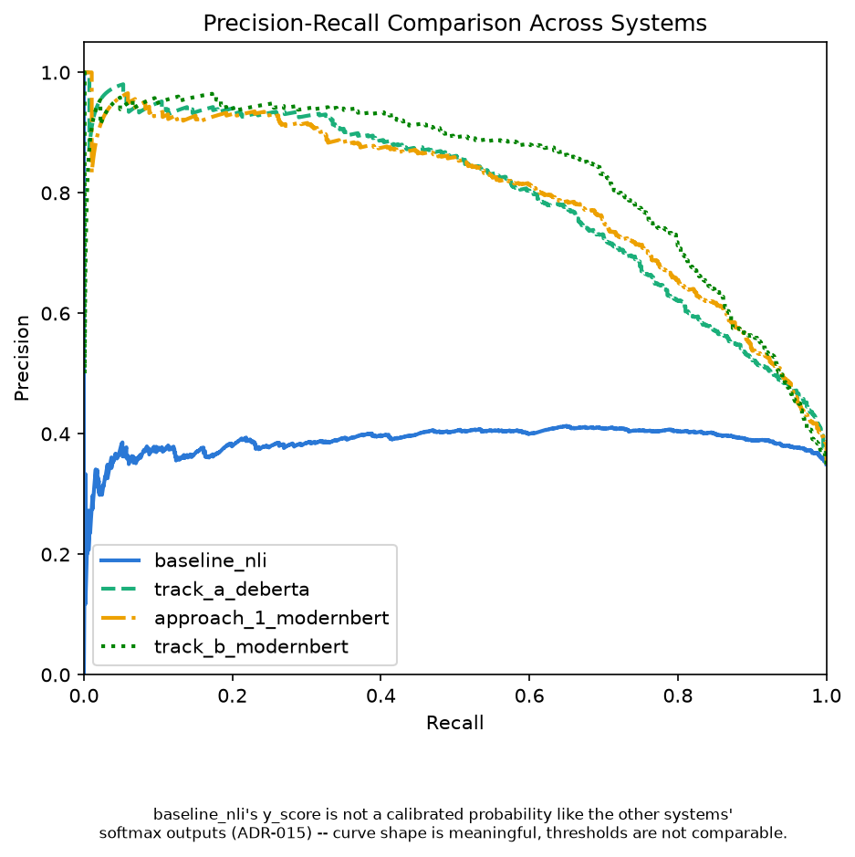

\# RAG Hallucination Detector


Hallucination detector for RAG systems based on DeBERTa-v3 + NLI, trained on RAGTruth.


🚧 Work in progress. See `docs/00-roadmap.md` for the implementation plan.

## Setup

```bash
pip install --upgrade pip  # on fresh Python 3.12 environments, an old pip fails due to the removed distutils module — unrelated to any package in requirements.txt
pip install -r requirements.txt
```

## Dataset

This project trains and evaluates on [RAGTruth](https://github.com/ParticleMedia/RAGTruth)
(Niu et al., 2024, *RAGTruth: A Hallucination Corpus for Developing and Evaluating
RAG Systems*, ACL 2024, [arXiv:2401.00396](https://arxiv.org/abs/2401.00396)), a
word-level hallucination benchmark spanning three RAG task types (QA, Summary,
Data2txt) with span-level annotations from human reviewers. It is MIT-licensed
(confirmed in Phase 1 — see `data/raw/ragtruth/LICENSE`).


Three problem representations are planned across this project:
1. **Response-level binary** — one label per (context, response) pair: did the
   response hallucinate at all? This is the representation `src/data/preprocess.py`
   currently produces (`response_level_{train,val,test}.parquet`), and Phase 1's
   deliverable.
2. **Sentence-level NLI pairs** — one (context, sentence) premise/hypothesis pair
   per response sentence, entailment-style.
3. **Token-level BIO** — `B-HALL`/`I-HALL`/`O` tags per token, for exact span
   recovery.

RAGTruth's context length varies drastically by `task_type`, and 70.34% of rows
exceed DeBERTa-v3's 512-token limit once context + response + special tokens are
combined — see [ADR-004](docs/decisions.md#adr-004-long-context-truncation-strategy-for-deberta-v3-input)
for the full truncation strategy discussion. The current MVP truncates only the
context (never the response); one row (`source_id` 11845) had a response alone
exceeding the token budget and was dropped rather than breaking that guarantee
(see [ADR-006](docs/decisions.md)).

Final response-level dataset (`data/processed/`, generated by
`src/data/preprocess.py`, not committed — see below):

| split | rows | label_response=0 (faithful) | label_response=1 (hallucinated) |
|---|---|---|---|
| train | 13,578 | 7,520 (55.4%) | 6,058 (44.6%) |
| val | 1,511 | 848 (56.1%) | 663 (43.9%) |
| test | 2,700 | 1,757 (65.1%) | 943 (34.9%) |

`val` is a 10% group-stratified split of the official `train` set (grouped by
`source_id` so sibling responses never leak across train/val — see
[ADR-005](docs/decisions.md)); `test` is RAGTruth's official held-out split.
Total: 17,789 rows (17,790 official responses minus the 1 dropped outlier).

`data/processed/*.parquet` is gitignored (generated artifact, reproducible via
`python src/data/preprocess.py` once `python src/data/download.py` has fetched
the raw RAGTruth data).

## Results (RAGTruth test set, response-level)

All four systems are evaluated on identical footing: per-row test predictions for
every system live in `results/unified_predictions.parquet` (written by
`scripts/collect_predictions.py`), and every number below comes from
`comparison_table()` in `src/evaluation/metrics.py`. Positive class = hallucinated;
n = 2,700 responses (943 hallucinated, 1,757 faithful).

| System | Precision | Recall | F1 | Accuracy |
|---|---|---|---|---|
| Always "hallucinated" (trivial) | 0.3493 | 1.0000 | 0.5177 | 0.3493 |
| Random 50/50 (expected) | 0.3493 | 0.5000 | 0.4113 | 0.5000 |
| NLI zero-shot (DeBERTa-v3-base, MoritzLaurer checkpoint) | 0.3547 | 0.9979 | 0.5234 | 0.3652 |
| Fine-tuned DeBERTa-v3-base (Track A) | 0.7367 | 0.6882 | 0.7116 | 0.8052 |
| Fine-tuned ModernBERT-base (Approach 1) | 0.6832 | 0.7731 | 0.7254 | 0.7956 |
| **Fine-tuned ModernBERT, binary token classification (Track B)** | **0.7873** | **0.7381** | **0.7619** | **0.8389** |

**Track B is the best-performing system**, and it matches LettuceDetect-base's
published example-level F1 of 76.07% on the same benchmark
([arXiv:2502.17125](https://arxiv.org/abs/2502.17125)): 76.19% in this unified
evaluation (76.11% under [ADR-014](docs/decisions.md)'s original evaluation, within
0.04 points of published). See [ADR-013](docs/decisions.md) for the recipe redesign
that got it there and [ADR-014](docs/decisions.md) for the validation.




Fine-tuned models: [hugoomezz/deberta-v3-ragtruth-hallucination](https://huggingface.co/hugoomezz/deberta-v3-ragtruth-hallucination),
[hugoomezz/modernbert-ragtruth-token-level-binary](https://huggingface.co/hugoomezz/modernbert-ragtruth-token-level-binary)

The zero-shot NLI baseline (F1 0.523) barely outperforms the trivial "always
hallucinated" baseline (F1 0.518): with recall ≈1.0 it flags almost everything, so
overall it is close to non-discriminative. A diagnostic on the cached scores
(`scripts/diagnose_baseline_flagging.py`, see
[ADR-009](docs/decisions.md)) traced this to poor calibration of the raw per-sentence
NLI scores, *not* the aggregation rule: the "contradicted" flag fires on 55.7% of
genuinely faithful sentences vs 53.8% of hallucinated ones (almost no signal), and
median entailment for faithful sentences is only 0.169 — a generic NLI model checking
isolated sentence/chunk pairs struggles when a faithful response synthesizes
information spread across multiple context chunks. Switching to a proportion-based
aggregation rule was tested and moved F1 only marginally (0.611 → 0.632 on val),
ruling out aggregation as the cause. The one bright spot is **Data2txt (F1 0.783)**,
where the task-type-aware chunking of [ADR-008](docs/decisions.md) turns structured
fields into clean `key: value` evidence. These findings motivate the fine-tuned
approach in Phase 3, which should learn domain-appropriate support/contradiction
calibration the zero-shot model lacks.

Fine-tuning clearly delivers: F1 climbs from 0.523 (zero-shot NLI) to 0.712, a
substantial jump driven by precision moving from near-non-discriminative (0.355) to
0.737 while recall drops from an over-flagging ~1.0 to a more selective 0.688.
Per-task_type results show **Data2txt is now the strongest (F1 0.848)** and
**Summary the weakest (F1 0.332, recall only 0.245)** — the inverse of the zero-shot
baseline's near-perfect recall, confirming the fine-tuned model is discriminating
rather than just flagging everything. A truncation-correlation diagnostic
(`scripts/analyze_track_a_predictions.py`, see [ADR-010](docs/decisions.md)) found
that context truncation's cost is **precision-driven, not recall-driven** as
originally hypothesized in [ADR-004](docs/decisions.md#adr-004-long-context-truncation-strategy-for-deberta-v3-input):
truncated rows actually show *higher* recall on hallucinated examples than
untruncated rows, but *lower* overall accuracy, implying truncation mainly causes
faithful responses to be over-flagged, not hallucinations to be missed. The same
diagnostic found Summary's low recall is largely independent of truncation —
both truncated and untruncated Summary rows score similarly poorly — pointing
instead to "subtle" hallucination types (RAGTruth's rarest label category) being
inherently harder to detect regardless of context completeness (see
[ADR-010](docs/decisions.md) for full detail).

[ADR-011](docs/decisions.md#adr-011-modernbert-eliminates-truncation-entirely-on-ragtruth)
confirmed that switching to ModernBERT-base (max_length=4096) eliminates truncation
entirely on RAGTruth (0.00% of rows truncated, vs. 70.34% under DeBERTa's 512-token
limit). Training the same response-level recipe on this truncation-free backbone
(Approach 1) raised overall F1 from 0.712 to 0.726 — but,
contrary to ADR-010's prediction that truncation's cost was precision-driven,
[ADR-012](docs/decisions.md#adr-012-modernbert-approach-1-results--recall-driven-improvement-not-precision-driven)
found the gain is actually recall-driven: precision slipped slightly (0.737 → 0.684)
while recall jumped (0.688 → 0.773). The effect is concentrated almost entirely in
**Summary**, where recall more than doubled (0.245 → 0.569) and F1 rose from 0.332 to
0.509, resolving the severe recall weakness Track A left unexplained; QA and
Data2txt shifted only marginally. The lesson: a correlational diagnostic on a fixed
architecture (ADR-010) does not necessarily predict the causal effect of changing
that architecture (ADR-012) — ModernBERT's long context helps the model *find*
scattered evidence rather than making it less trigger-happy under uncertainty.
Approach 1 is now the stronger response-level model; Track B (token-level span
detection) is planned next on this ModernBERT backbone.

### Track B: token-level span detection

Track B's first training run used a 3-class BIO scheme and produced a near-total
span-detection failure (0.037 seqeval F1). [ADR-013](docs/decisions.md) diagnosed
the cause as an extreme 95x class weight on the ultra-rare B-HALL token fragmenting
real spans, compounded by comparing against the wrong LettuceDetect metric, and
redesigned the recipe to match LettuceDetect's actual approach (arXiv:2502.17125):
binary token labels, unweighted loss, and character-overlap span evaluation instead
of strict entity matching.

That redesign closely matches published LettuceDetect-base numbers on the same
benchmark: a span-level (char-overlap) F1 of **51.13%**, vs. LettuceDetect-base's
published **55.44%**, and a response-level F1 of 76.11% vs. their published
76.07% — functionally equivalent at the response level. See
[ADR-013](docs/decisions.md) for the diagnosis and redesign, and
[ADR-014](docs/decisions.md) for the validated results.

### Error analysis

[`notebooks/03_error_analysis.ipynb`](notebooks/03_error_analysis.ipynb) dissects the
best system (Track B) row by row — confusion matrix, error categorization against the
raw test-set text, qualitative examples, and threshold sensitivity. Five takeaways:

1. **The headline F1 (0.762) is an average over very different tasks.** Data2txt is
   close to solved (F1 0.869), while Summary is the weak spot (F1 0.513, recall
   0.436) — the model misses more than half of all hallucinated summaries. Any claim
   about this detector needs a task-type qualifier.
2. **The model is overconfident, not paranoid.** It misses 26.2% of hallucinated
   responses but false-alarms on only 10.7% of faithful ones (247 FN vs 188 FP). The
   token-level decision rule — flag only if some token crosses P(hallucinated) ≥ 0.5 —
   structurally favors silence over alarm: diffuse suspicion never triggers.
3. **Context length is a task-mix confound, not a real driver — and truncation is
   ruled out.** The apparent FN-rate swing across context-length quartiles
   (16.5%–46.8%) disappears within a task (each quartile is dominated by a different
   task type); the longest model-visible sequence is 2,388 tokens against the
   4,096-token window, so no test row was truncated.
4. **Subtle hallucinations from the strongest generators are the hardest case.**
   Responses annotated only with "Subtle" span types are missed 40.3% of the time (vs
   27.0% for evident-only), and detection F1 drops to ≈0.48–0.52 on GPT-3.5/GPT-4
   outputs, where hallucinations are rare and subtle — exactly the deployment
   scenario that matters most.
5. **The decision threshold is a product decision, and one model serves both modes.**
   F1 is nearly flat across thresholds 0.2–0.7, so the same checkpoint supports a
   high-precision **block mode** (t = 0.9: precision 0.879, recall 0.602 — ~1 in 8
   blocks is a mistake, but 4 in 10 hallucinations get through) and a high-recall
   **warn mode** (t = 0.1: recall 0.843, precision 0.642 — ~5 in 6 hallucinations
   caught, ~1 in 3 warnings unnecessary). Even at the most aggressive setting ~16% of
   hallucinations slip through: a risk reducer, not a guarantee.

Two illustrative cases from the notebook (gold-annotated hallucinated spans marked
`**[[...]]**`; the notebook has five, with full contexts):

**Caught — true positive at y_score 1.00** (QA, llama-2-70b-chat, gold: Evident +
Subtle Baseless Info). Asked *"how to plan a trip to germany"* over passages about
budget tips, pet travel, and culture, the generator padded its list with advice from
nowhere, and the detector flagged it:

> 5. Check visa requirements: Make sure you have the necessary documents and visas
> required for entry into Germany, if applicable.
> **[[6. Pack appropriately: Germany can get quite chilly, especially in the winter
> months, so pack warm clothing and comfortable shoes for sightseeing.
> 7. Use travel apps: Utilize travel apps like Google Maps or Rome2rio to plan your
> itinerary and navigate through German cities.]]**
> 8. Learn some basic German phrases: While many Germans speak English fluently, it's
> always appreciated when visitors make an effort to speak the local language.
> **[[Learning basic phrases like "hello" (Hallo), "thank you" (Danke), and "excuse
> me" (Entschuldigung)]]** can go a long way [...]

**Missed — false negative at y_score 0.004** (Data2txt, gpt-4-0613, gold: Subtle
Baseless Info). Summarizing a Yelp-style business record, GPT-4 added plausible
glosses that appear nowhere in the structured data, and the detector saw almost
nothing wrong:

> Radio Prophets is a **[[well-regarded local business]]** based in Santa Barbara, CA
> that offers a wide range of services such as music performances, event planning,
> and wedding planning. [...] The band also takes pride in their efficient
> communication, easy planning, and their **[[ability to make memorable events for
> their clients]]**. Street parking is available and the venue also offers outdoor
> seating.

This pair is the model's temperament in miniature: confident, list-padding fabrication
gets caught; smooth, plausible-sounding embellishment of real facts slips through.

