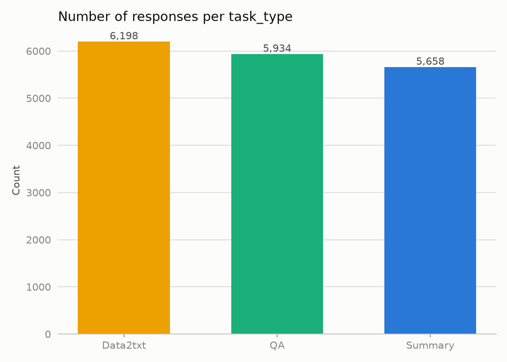
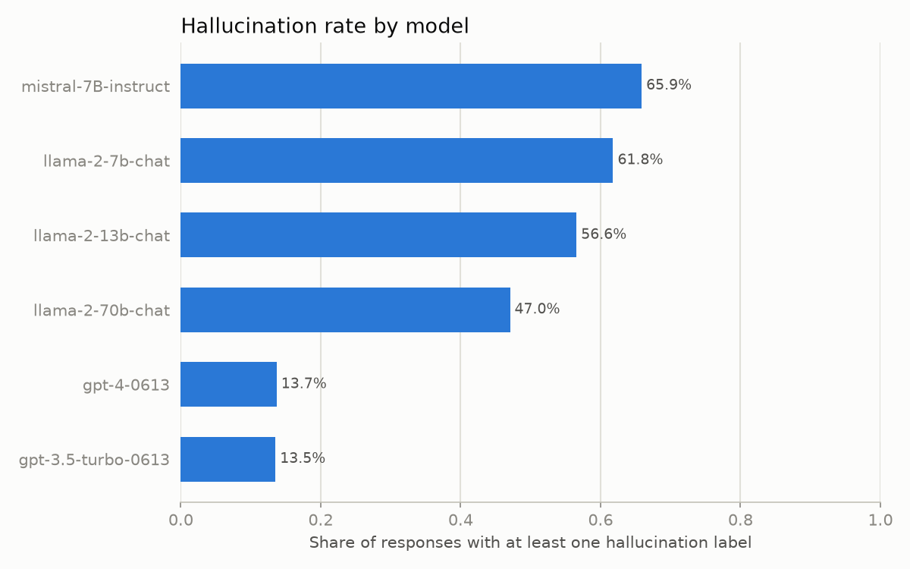
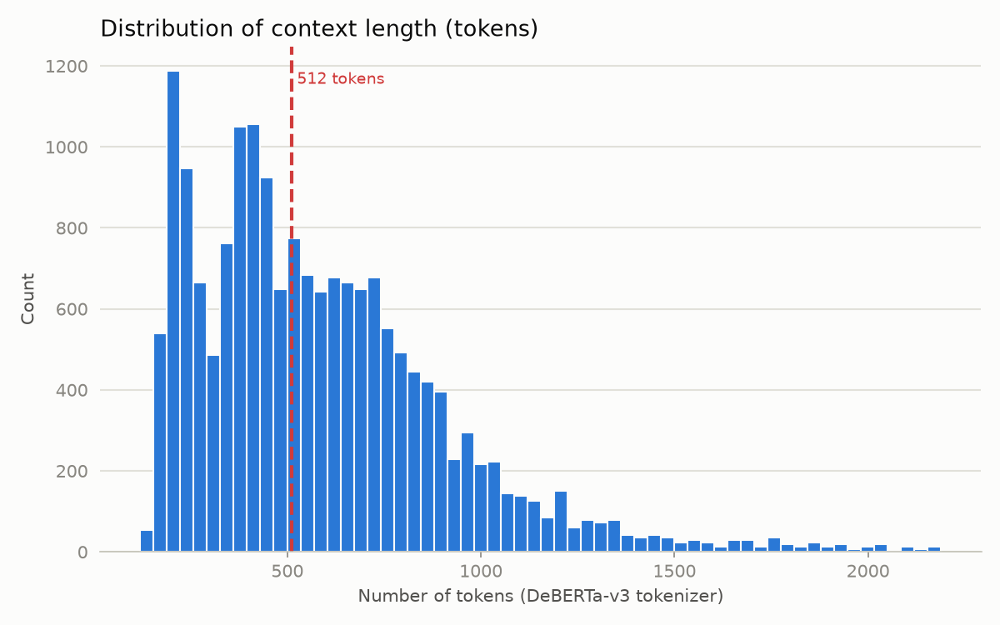

\# RAG Hallucination Detector


Hallucination detector for RAG systems based on DeBERTa-v3 + NLI, trained on RAGTruth.


🚧 Work in progress. See `docs/00-roadmap.md` for the implementation plan.

## Setup

```bash
pip install --upgrade pip  # on fresh Python 3.12 environments, an old pip fails due to the removed distutils module — unrelated to any package in requirements.txt
pip install -r requirements.txt
```

## Dataset

This project trains and evaluates on [RAGTruth](https://github.com/ParticleMedia/RAGTruth)
(Niu et al., 2024, *RAGTruth: A Hallucination Corpus for Developing and Evaluating
RAG Systems*, ACL 2024, [arXiv:2401.00396](https://arxiv.org/abs/2401.00396)), a
word-level hallucination benchmark spanning three RAG task types (QA, Summary,
Data2txt) with span-level annotations from human reviewers. It is MIT-licensed
(confirmed in Phase 1 — see `data/raw/ragtruth/LICENSE`).





Three problem representations are planned across this project:
1. **Response-level binary** — one label per (context, response) pair: did the
   response hallucinate at all? This is the representation `src/data/preprocess.py`
   currently produces (`response_level_{train,val,test}.parquet`), and Phase 1's
   deliverable.
2. **Sentence-level NLI pairs** — one (context, sentence) premise/hypothesis pair
   per response sentence, entailment-style.
3. **Token-level BIO** — `B-HALL`/`I-HALL`/`O` tags per token, for exact span
   recovery.

RAGTruth's context length varies drastically by `task_type`, and 70.34% of rows
exceed DeBERTa-v3's 512-token limit once context + response + special tokens are
combined — see [ADR-004](docs/decisions.md#adr-004-long-context-truncation-strategy-for-deberta-v3-input)
for the full truncation strategy discussion. The current MVP truncates only the
context (never the response); one row (`source_id` 11845) had a response alone
exceeding the token budget and was dropped rather than breaking that guarantee
(see [ADR-006](docs/decisions.md)).

Final response-level dataset (`data/processed/`, generated by
`src/data/preprocess.py`, not committed — see below):

| split | rows | label_response=0 (faithful) | label_response=1 (hallucinated) |
|---|---|---|---|
| train | 13,578 | 7,520 (55.4%) | 6,058 (44.6%) |
| val | 1,511 | 848 (56.1%) | 663 (43.9%) |
| test | 2,700 | 1,757 (65.1%) | 943 (34.9%) |

`val` is a 10% group-stratified split of the official `train` set (grouped by
`source_id` so sibling responses never leak across train/val — see
[ADR-005](docs/decisions.md)); `test` is RAGTruth's official held-out split.
Total: 17,789 rows (17,790 official responses minus the 1 dropped outlier).

`data/processed/*.parquet` is gitignored (generated artifact, reproducible via
`python src/data/preprocess.py` once `python src/data/download.py` has fetched
the raw RAGTruth data).

## Results (RAGTruth test set, response-level)

| Approach | Precision | Recall | F1 |
|---|---|---|---|
| Always "hallucinated" (trivial) | 0.349 | 1.000 | 0.518 |
| Random | 0.350 | 0.497 | 0.411 |
| NLI zero-shot (DeBERTa-v3-base, MoritzLaurer checkpoint) | 0.355 | 0.998 | 0.523 |
| Fine-tuned DeBERTa-v3-base (Track A) | 0.737 | 0.688 | 0.712 |
| **Fine-tuned ModernBERT-base (Approach 1)** | 0.6839 | 0.7731 | 0.7257 |

Fine-tuned model: [hugoomezz/deberta-v3-ragtruth-hallucination](https://huggingface.co/hugoomezz/deberta-v3-ragtruth-hallucination)

**Per task_type (test set), zero-shot NLI baseline:**

| task_type | Precision | Recall | F1 |
|---|---|---|---|
| Summary | 0.227 | 1.000 | 0.370 |
| QA | 0.185 | 0.988 | 0.311 |
| Data2txt | 0.643 | 1.000 | 0.783 |

**Per task_type (test set), fine-tuned Track A vs. ModernBERT Approach 1:**

| task_type | Track A Precision | Track A Recall | Track A F1 | ModernBERT Precision | ModernBERT Recall | ModernBERT F1 |
|---|---|---|---|---|---|---|
| Summary | 0.515 | 0.245 | 0.332 | 0.460 | 0.569 | 0.509 |
| QA | 0.533 | 0.650 | 0.586 | 0.524 | 0.681 | 0.592 |
| Data2txt | 0.840 | 0.855 | 0.848 | 0.832 | 0.870 | 0.851 |

The zero-shot NLI baseline (F1 0.523) barely outperforms the trivial "always
hallucinated" baseline (F1 0.518): with recall ≈1.0 it flags almost everything, so
overall it is close to non-discriminative. A diagnostic on the cached scores
(`scripts/diagnose_baseline_flagging.py`, see
[ADR-009](docs/decisions.md)) traced this to poor calibration of the raw per-sentence
NLI scores, *not* the aggregation rule: the "contradicted" flag fires on 55.7% of
genuinely faithful sentences vs 53.8% of hallucinated ones (almost no signal), and
median entailment for faithful sentences is only 0.169 — a generic NLI model checking
isolated sentence/chunk pairs struggles when a faithful response synthesizes
information spread across multiple context chunks. Switching to a proportion-based
aggregation rule was tested and moved F1 only marginally (0.611 → 0.632 on val),
ruling out aggregation as the cause. The one bright spot is **Data2txt (F1 0.783)**,
where the task-type-aware chunking of [ADR-008](docs/decisions.md) turns structured
fields into clean `key: value` evidence. These findings motivate the fine-tuned
approach in Phase 3, which should learn domain-appropriate support/contradiction
calibration the zero-shot model lacks.

Fine-tuning clearly delivers: F1 climbs from 0.523 (zero-shot NLI) to 0.712, a
substantial jump driven by precision moving from near-non-discriminative (0.355) to
0.737 while recall drops from an over-flagging ~1.0 to a more selective 0.688.
Per-task_type results show **Data2txt is now the strongest (F1 0.848)** and
**Summary the weakest (F1 0.332, recall only 0.245)** — the inverse of the zero-shot
baseline's near-perfect recall, confirming the fine-tuned model is discriminating
rather than just flagging everything. A truncation-correlation diagnostic
(`scripts/analyze_track_a_predictions.py`, see [ADR-010](docs/decisions.md)) found
that context truncation's cost is **precision-driven, not recall-driven** as
originally hypothesized in [ADR-004](docs/decisions.md#adr-004-long-context-truncation-strategy-for-deberta-v3-input):
truncated rows actually show *higher* recall on hallucinated examples than
untruncated rows, but *lower* overall accuracy, implying truncation mainly causes
faithful responses to be over-flagged, not hallucinations to be missed. The same
diagnostic found Summary's low recall is largely independent of truncation —
both truncated and untruncated Summary rows score similarly poorly — pointing
instead to "subtle" hallucination types (RAGTruth's rarest label category) being
inherently harder to detect regardless of context completeness (see
[ADR-010](docs/decisions.md) for full detail).

[ADR-011](docs/decisions.md#adr-011-modernbert-eliminates-truncation-entirely-on-ragtruth)
confirmed that switching to ModernBERT-base (max_length=4096) eliminates truncation
entirely on RAGTruth (0.00% of rows truncated, vs. 70.34% under DeBERTa's 512-token
limit). Training the same response-level recipe on this truncation-free backbone
(Approach 1) raised overall F1 from 0.712 to 0.726 — but,
contrary to ADR-010's prediction that truncation's cost was precision-driven,
[ADR-012](docs/decisions.md#adr-012-modernbert-approach-1-results--recall-driven-improvement-not-precision-driven)
found the gain is actually recall-driven: precision slipped slightly (0.737 → 0.684)
while recall jumped (0.688 → 0.773). The effect is concentrated almost entirely in
**Summary**, where recall more than doubled (0.245 → 0.569) and F1 rose from 0.332 to
0.509, resolving the severe recall weakness Track A left unexplained; QA and
Data2txt shifted only marginally. The lesson: a correlational diagnostic on a fixed
architecture (ADR-010) does not necessarily predict the causal effect of changing
that architecture (ADR-012) — ModernBERT's long context helps the model *find*
scattered evidence rather than making it less trigger-happy under uncertainty.
Approach 1 is now the stronger response-level model; Track B (token-level span
detection) is planned next on this ModernBERT backbone.

