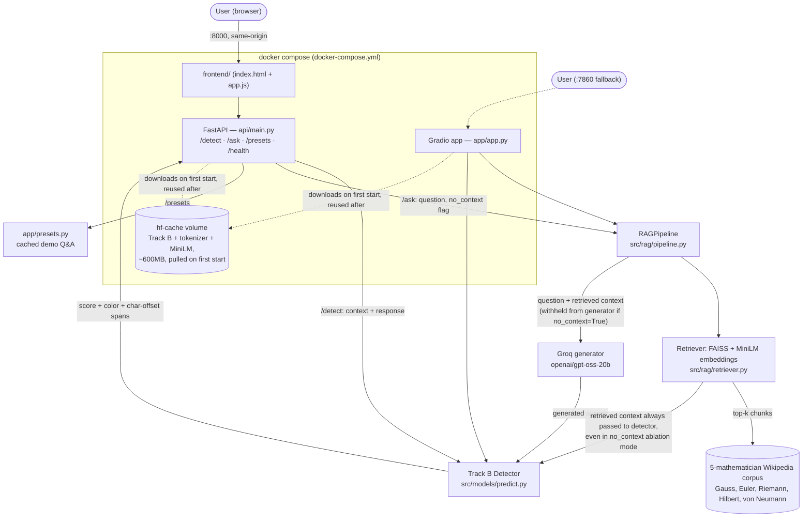

# Architecture

The real, deployed system (Phase 5/6/ADR-019).

## Notes

- **Same-origin, no CORS** (ADR-019): the custom frontend is static files served
  directly by the FastAPI process at `:8000`, not a separate service.
- **Gradio (`:7860`) is a fallback**, kept from Phase 6 alongside the custom frontend,
  not the primary demo.
- **No public hosting** (ADR-018): HF now PRO-gates personal Gradio Spaces, so the
  system runs entirely via local `docker compose up` — there is no public URL.
- **The detector always checks the real retrieved context**, even in `no_context`
  ablation mode (ADR-016) — only the *generator* is blinded to it, so the demo can show
  the detector catching a live hallucination rather than a scripted example.
- **Models are not baked into the Docker image** — they download from the HF Hub into
  the named `hf-cache` volume on first `docker compose up` and are reused after that.
